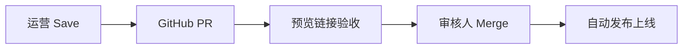

# 运营人员文档编辑手册

面向 **运营 / 产品 / 市场** 的日常操作说明。技术搭建见 [decap-cms-setup.md](./decap-cms-setup.md)。

---

## 一、你能做什么

- 在线编辑文档（Markdown 可视化编辑器）
- **拖拽上传截图**，自动插入文章
- 修改简体中文、英文、繁体中文文档
- 更新发版日志
- 保存后自动创建 PR，审核通过后自动上线

你 **不需要** 安装 Node.js 或懂 Git 命令行。

---

## 二、登录

1. 打开：**https://adgine.ai/docs/admin/**
2. 点击 **Login with GitHub**
3. 使用公司分配的 GitHub 账号登录并授权

> 若没有 GitHub 账号或无法登录，联系管理员将你加入 `adgine-docs` 仓库。

---

## 三、编辑一篇文档

1. 登录后，左侧选择集合，例如 **简体中文 · 功能指南**
2. 点击要修改的文档（如「品牌认知」）
3. 在编辑器中修改标题、正文
4. 点击右上角 **Save**（保存）

### 保存后会发生什么

- 系统会在 GitHub 创建 **Pull Request（PR）**
- Cloudflare 自动生成 **预览链接**（在 PR 页面查看）
- **不会立即上线**，需审核人合并 PR 后才发布

---

## 四、添加图片 / 截图

### 方法一：拖拽上传（推荐）

1. 在正文编辑区，将图片文件 **拖入** 编辑器
2. 系统自动上传并插入 Markdown：

   ```markdown
   
   ```

### 方法二：工具栏插入

1. 点击编辑器工具栏的 **图片** 按钮
2. 选择 **Upload** 上传本地文件

### 截图规范

| 项目 | 要求 |
|------|------|
| 格式 | PNG 或 WebP |
| 宽度 | 约 1200 像素 |
| 命名 | `模块-功能-步骤.png`，如 `brand-profile-step1.png` |
| 内容 | 打码 API Key、客户隐私信息 |
| 语言 | 中文文档用中文界面截图；英文文档用英文界面 |

图片保存在仓库 `static/img/docs/`，不会丢失。

---

## 五、多语言怎么维护

后台按语言分了多个集合：

| 集合 | 维护对象 |
|------|----------|
| 简体中文 · * | 大陆用户主文档（**优先维护**） |
| English · * | 英文用户文档 |
| 繁體中文 · * | 港澳台用户文档 |

### 推荐流程

1. **先改简体中文**
2. 有英文需求时，打开对应 **English ·** 集合同步修改
3. 繁体可后续补充，或请同事翻译

> 侧边栏目录名称已支持多语言；正文需分别在各语言集合中维护。

---

## 六、发版时更新日志

1. 打开集合 **更新日志**
2. 在正文顶部添加新版本条目，例如：

   ```markdown
   ## 2026-07-15

   ### 新增
   - 品牌监控功能文档

   ### 更新
   - 可见性分析：补充 Perplexity 截图
   ```

3. Save → 走 PR 审核流程

---

## 七、审核与发布流程



| 角色 | 做什么 |
|------|--------|
| 运营 | 编辑、上传图片、Save |
| 产品/开发 | 打开 PR 预览链接检查，确认后 Merge |
| 系统 | Merge 后约 1–2 分钟自动发布到 adgine.ai/docs |

---

## 八、新建文档（注意事项）

你可以在已有分类下 **新建** 文档，但：

- **文档 ID** 需与开发确认（影响 URL 和侧边栏）
- **新增侧边栏菜单项** 需开发改配置，请联系开发协助

新建时填写 frontmatter：

| 字段 | 说明 | 示例 |
|------|------|------|
| 文档 ID | 唯一标识 | `brand-monitor` |
| 标题 | 页面标题 | `品牌监控` |
| SEO 描述 | 搜索摘要 | 一句话描述 |
| 正文 | Markdown 内容 | — |

---

## 九、常见问题

**Q：保存失败？**  
A：确认 GitHub 账号已被加入仓库并有编辑权限。

**Q：图片上传后页面不显示？**  
A：等 PR 合并上线后再看；预览链接中应能看到。

**Q：改了中文，英文页面没变？**  
A：中英文分开维护，需分别编辑对应集合。

**Q：能直接改线上吗？**  
A：不能。必须走 PR，审核合并后才上线（防止误操作）。

**Q：和 Word / 飞书文档比？**  
A：这是产品文档站，用 Markdown 维护，SEO 和版本管理更好。日常在后台编辑即可，体验接近在线文档。

---

## 十、联系与支持

| 问题类型 | 找谁 |
|----------|------|
| 登录、权限 | 管理员 / 开发 |
| 文档内容审核 | 产品负责人 |
| 新增菜单、新功能文档结构 | 开发 |
| 截图、文案 | 运营自行处理 |

**后台地址**：https://adgine.ai/docs/admin/  
**文档站地址**：https://adgine.ai/docs/
