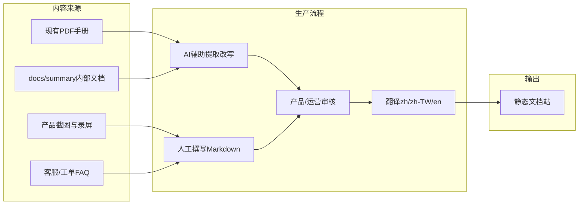
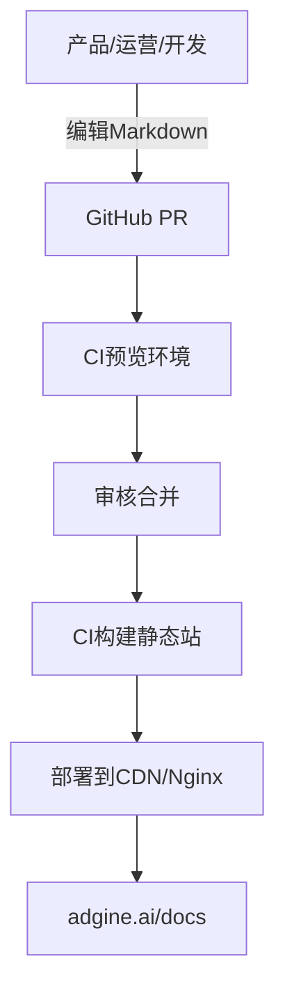
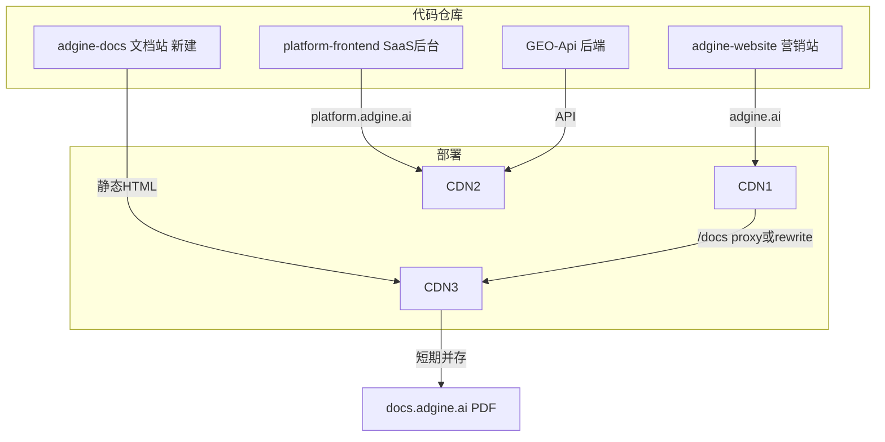

# Adgine 产品文档站规划

## 目标与参考

你要做的是 **SaaS 产品使用手册**（功能指南、快速入门、操作步骤），参考 [SheepGeo 文档](https://sheepgeo.com/docs) 的信息架构，而不是开发者 API 文档。

当前现状：
- 已有 PDF 手册：`https://docs.adgine.ai/files/Adgine使用手册-v20260531.pdf`（见 [`adgine_geo_skills/adgine-geo-docs/SKILL.md`](adgine_geo_skills/adgine-geo-docs/SKILL.md)）
- GEO-Api 内有大量 **内部技术文档**（[`docs/summary/`](docs/summary/)、[`docs/zh/`](docs/zh/)），偏开发/运维，不能直接当用户手册发布
- API 已有 Swagger：`platform.adgine.ai` 的 FastAPI `/docs`（与产品文档站是不同受众）

域名策略（你已选）：**短期并存，逐步迁移** — `docs.adgine.ai` 继续服务 PDF，`adgine.ai/docs` 新建结构化文档站，后期再统一。

---

## MkDocs 能否满足需求？

### 结论：能用，但不建议作为 2026 年新项目的首选

[MkDocs](https://www.mkdocs.org/) 配合 **Material for MkDocs** 主题，在视觉上可以做出接近 SheepGeo 的效果：左侧导航、全文搜索、功能卡片首页、多语言切换。

| 维度 | MkDocs + Material | 评价 |
|------|-------------------|------|
| SheepGeo 式产品文档 | 支持 | Markdown + 导航 + 搜索，足够 |
| 多语言 | 需 `mkdocs-static-i18n` 插件 | 可用，但不如 Docusaurus 原生 |
| 编辑后台 | **无** | 只能 Git + Markdown |
| 自动扫描网站/API | **基本不支持** | 见下文「内容生产」 |
| 2026 维护风险 | Material 已进入 maintenance mode | 生态分裂，长期有风险 |

**MkDocs 没有「编辑后台入口」** — 这是常见误解。它的工作流是：开发者在 IDE 里写 Markdown → `mkdocs serve` 本地预览 → CI 构建静态 HTML → 部署。没有 WordPress/GitBook 那样的在线 CMS。

### 更推荐的替代方案

按你的场景（产品手册 + 多语言 + 独立部署 + 非 API 文档），推荐优先级：

1. **Docusaurus**（首推）
   - 原生 i18n（zh / zh-TW / en 与你们 API 的 [`src/geo/auth/i18n.py`](src/geo/auth/i18n.py) 语言策略一致）
   - 功能卡片、侧边栏、Algolia 搜索、版本管理都成熟
   - React 生态，社区最大，2026 年维护活跃
   - 适合独立 `adgine-docs` 仓库

2. **VitePress**（次选）
   - 更轻、构建更快，默认主题干净
   - i18n 支持但不如 Docusaurus 成熟
   - 适合团队偏好 Vue、文档体量中等

3. **Nextra**（若 adgine.ai 官网已是 Next.js）
   - 与官网同技术栈，可 monorepo 放在 `adgine-website/apps/docs`
   - `adgine.ai/docs` 可用 Next.js rewrites 同域部署，SEO 最顺

4. **GitBook / Mintlify**（若要「非技术人员在线编辑」）
   - 有 Web 编辑器，但 SaaS 收费、内容锁定在平台
   - 适合市场/运营团队主导维护，开发参与度低

**不推荐放在 GEO-Api 里用 MkDocs**：Python 后端仓库混文档站会增加部署耦合，且 FastAPI 已有 `/docs` 路径，概念上易混淆。

---

## 问题 1：文档如何生产和编辑？能否自动生成？

### 现实结论：产品手册 **无法可靠全自动**，只能「半自动辅助 + 人工审核」



| 来源 | 能否自动扫描 | 说明 |
|------|-------------|------|
| `platform.adgine.ai` 前端 UI | 不能可靠自动 | UI 是 React 组件 + 权限态，爬虫无法理解「功能含义」；最多用 Playwright 批量截图辅助 |
| `adgine.ai` 官网 | 不能 | 营销页 ≠ 产品操作手册 |
| `geo-api` 代码/OpenAPI | 不适合本次 | 你选的是产品手册，不是 API 文档；OpenAPI 只能生成接口参考 |
| 现有 PDF 手册 | **半自动** | PDF → Markdown（pandoc/AI），需大量人工校对 |
| [`docs/summary/`](docs/summary/) | **半自动** | 技术视角，需改写为用户语言（去实现细节、加截图步骤） |

**可落地的自动化辅助**（建议纳入 CI，而非指望一键生成）：
- 从 PDF 提取初稿 → PR 人工润色
- 用你们已有的 [`src/geo/translate/`](src/geo/translate/) LLM 翻译能力做 **翻译草稿**（仍需母语审核）
- 截图脚本：Playwright 对 staging 环境按路由批量截图，嵌入文档
- 链接校验：CI 检查文档内链接是否 404
- **不做**「扫描整个 SaaS 自动生成手册」— 投入产出比极低，质量不可控

---

## 问题 2：后期如何编辑维护？

### 推荐工作流：Git-based Docs-as-Code（与 MkDocs/Docusaurus 通用）



**日常操作**：
1. 在 `adgine-docs` 仓库改 `.md` / `.mdx` 文件
2. PR 触发预览（Vercel/Netlify/自托管 preview）
3. 合并 main → 自动发布

**若运营团队不愿用 Git**，两条路：
- **轻量 CMS**：Decap CMS / TinaCMS 绑 GitHub，提供网页表单编辑 Markdown
- **GitBook**：完全在线编辑，导出/同步成本高，长期 vendor lock-in

**没有 MkDocs 专属「编辑后台」** — 若必须要 Web 后台，应选 GitBook 或 headless CMS，而不是 MkDocs。

---

## 问题 3：多语言支持

对齐现有 API 三语策略：**zh（简中，默认）/ zh-TW / en**

### Docusaurus i18n 结构（推荐）

```
adgine-docs/
  docs/
    zh/          # 默认语言，完整内容
      getting-started.md
      features/
        brand.md
    en/          # 英文版（可逐步补齐）
    zh-TW/       # 繁体（可从简体转换 + 人工校对）
  docusaurus.config.js   # locales: ['zh', 'zh-TW', 'en']
  i18n/
    zh/code.json   # UI 文案（搜索框、导航按钮）
```

**翻译策略**：
- **Phase 1**：先完成简体中文全套（对标 SheepGeo 的 ~18 个功能模块）
- **Phase 2**：英文（面向海外用户/SEO）
- **Phase 3**：繁体（可用简转繁 + 港澳台用语校对）
- 每篇文档 frontmatter 标记 `slug` 一致，确保语言切换时 URL 对应

**不建议**在运行时调用 API 动态翻译文档页 — 静态预渲染 SEO 更好、加载更快。

---

## 问题 4：文档模块应放在哪个项目？

### 客观最佳实践

| 放置位置 | 评分 | 分析 |
|----------|------|------|
| **独立仓库 `adgine-docs`** | 最佳 | 与前后端解耦；独立 CI/CD；市场/运营可单独 PR；不污染 API 部署 |
| **adgine.ai 官网仓库** | 次佳 | 若官网是 Next.js，可用 Nextra 子应用，`/docs` 同域部署最简单 |
| **platform.adgine.ai 前端** | 不推荐 | 产品后台需登录，文档应公开；混在一起增加构建体积、权限混乱 |
| **geo-api 后端** | 不推荐 | 后端只管 API；`build.sh` 只部署 Python 服务；FastAPI `/docs` 路径冲突 |

### 推荐架构



**`adgine.ai/docs` 实现方式**（二选一）：
- **A. 反向代理**（推荐）：Nginx/CDN 将 `adgine.ai/docs/*` 转发到文档静态站
- **B. Monorepo**：文档作为官网 Next.js 的 `/docs` 路由（Nextra）

GEO-Api 仓库可保留 [`docs/`](docs/) 作为 **内部开发文档**，通过 CI 脚本 **选择性同步** 摘要到 `adgine-docs`（单向、人工审核），但不作为文档站宿主。

---

## 建议的信息架构（对标 SheepGeo）

参考 SheepGeo 的模块划分，结合 Adgine 产品能力（从 [`docs/summary/`](docs/summary/) 和 skills 推断）：

**开始**
- 文档首页（功能选择说明 + 快速入门 4 步）
- 快速入门

**功能指南**（按产品模块，每篇：适用场景 / 操作步骤 / 截图 / 常见问题）
- 品牌认知 / 品牌设置
- 话题与关键词
- 内容生成与文章
- 机会分析
- 网站分析 / GEO 可见性
- 集成（WordPress / Cloudflare / Vercel / GSC / GA4）
- 仪表盘与报告
- 积分与订阅
- 账户与配额

**附录**
- 术语表
- 更新日志
- PDF 手册下载（链到 `docs.adgine.ai`，过渡期保留）

---

## 分阶段实施路线

### Phase 0 — 基建（1 周）
- 新建 `adgine-docs` 仓库，选 Docusaurus + 中文默认主题
- 配置 CI（push main → 构建 → 部署 preview + production）
- Nginx/CDN：`adgine.ai/docs` 路由到静态站
- 首页 + 2 篇示例文档验证链路

### Phase 1 — 内容迁移（2–4 周）
- PDF 手册提取 → 改写为 Markdown 功能指南
- 完成简体中文核心 10–15 篇（对标 SheepGeo 覆盖度）
- 文档首页加「功能选择说明」导航卡

### Phase 2 — 多语言（2 周）
- 启用 en、zh-TW locale
- 优先翻译：首页、快速入门、账户相关

### Phase 3 — 运营化（持续）
- 每个产品发版：文档 PR 与功能 PR 同步
- 文档页脚链到 `platform.adgine.ai` 注册/登录
- 逐步将 `docs.adgine.ai` PDF 流量导流到 `adgine.ai/docs`
- 更新 [`adgine-geo-docs/SKILL.md`](adgine_geo_skills/adgine-geo-docs/SKILL.md) 指向新文档站

---

## 关键决策摘要

| 问题 | 建议 |
|------|------|
| MkDocs 是否够用？ | 功能上够，但 2026 年维护风险高；推荐 **Docusaurus** |
| 能否自动生成？ | 不能全自动；PDF/内部文档可 AI 辅助提取，**人工审核必选** |
| 有没有编辑后台？ | MkDocs **没有**；用 Git PR 或 GitBook/Decap CMS |
| 多语言？ | Docusaurus 原生 i18n，zh / zh-TW / en |
| 放哪个项目？ | **独立 `adgine-docs` 仓库**，`adgine.ai/docs` 反代；不放 geo-api 或 platform 前端 |
